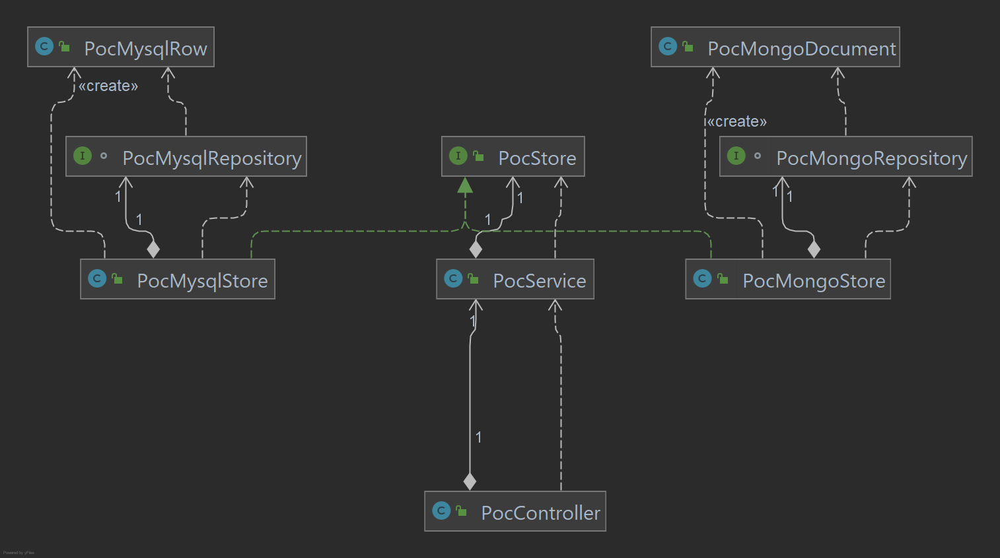
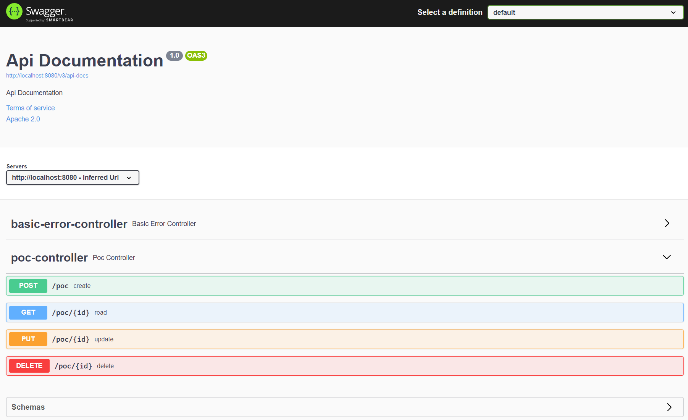

# REST SERVER WITH MAVEN Proof of concept
This simple maven project presents a proof of concept of microservice for a use case of a CRUD entity with 2 different databases as implementation:
* Mongo
* Mysql

The application is profile dependent, so it can only be run by using one of the two possible database implementations.

This is the class diagram of the main clases in the project:


## Compilation
This project is built with maven. Using the maven wrapper provided with the project is recommended.

**[JDK 11](https://jdk.java.net/archive/)** is needed.

For compiling the project and passing its test cases, you can use this: 
```shell
./mvnw clean package
```

## Execution

### Mysql execution
If you do not have a mysql server running you can easily run it with docker with this:
```shell
docker run --name mysql \
    -p 3306:3306 \
    -p 33060:33060 \
    -e MYSQL_ROOT_PASSWORD=root \
    --restart=unless-stopped \
    -d mysql:5.7 \
    --character-set-server=utf8 \
    --collation-server=utf8_unicode_ci \
    --disable-ssl
```
These are the standard spring.jpa/datasource properties to edit in case of need:
```properties
spring.jpa.database-platform=org.hibernate.dialect.MySQL5InnoDBDialect
spring.jpa.hibernate.ddl-auto=update
spring.datasource.driverClassName=com.mysql.cj.jdbc.Driver
spring.datasource.url=jdbc:mysql://localhost:3306/restServerWithMaven
spring.datasource.username=root
spring.datasource.password=root
```
Before running the application you need to create the application database, for instance:
```sql
CREATE DATABASE restServerWithMaven;
```
For running the server with the `mysql` profile enabled you can run this:
```shell
./mvnw clean spring-boot:run -Dspring-boot.run.profiles=mysql
```

### Mongo execution
If you do not have a mongo server running you can easily run it with docker with this:
```shell
docker run --name mongo \
    -p 27017:27017 \
    --restart unless-stopped \
    -d mongo
```
These are the standard mongodb properties to edit in case of need:
```properties
spring.data.mongodb.database=restServerWithMaven
spring.data.mongodb.host=localhost
spring.data.mongodb.port=27017
```
For running the server with the `mongo` profile enabled you can run this:
```shell
./mvnw clean spring-boot:run -Dspring-boot.run.profiles=mongo
```

### Once it is running
Once the server is running (with the default properties) you can navigate in your browser to the provided swagger interface:
http://localhost:8080/swagger-ui/


You can take a look at the provided [postman collection](doc/postman/README.md) for quering the app from Postman.


