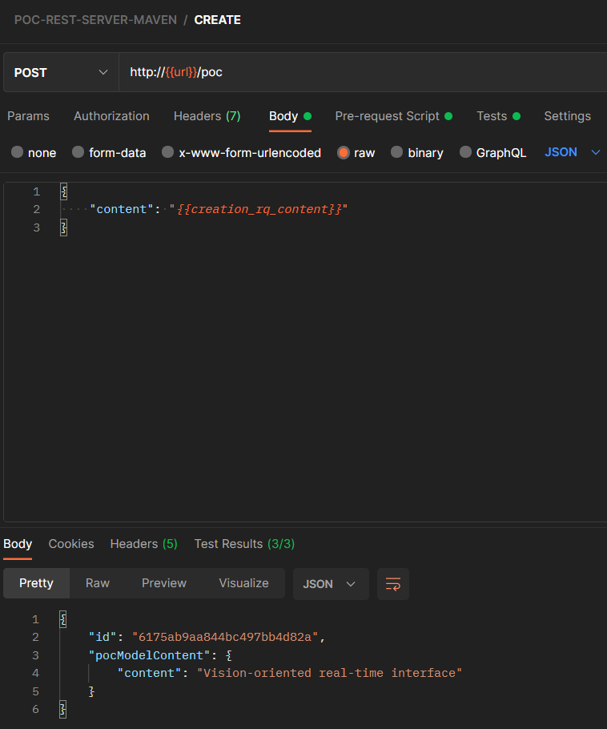
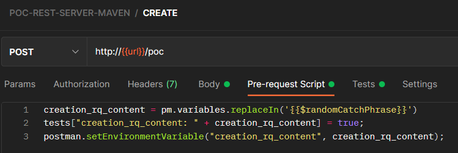
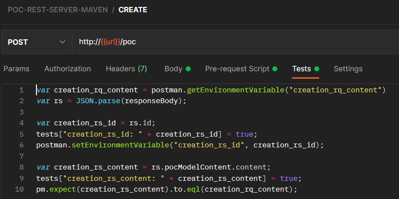
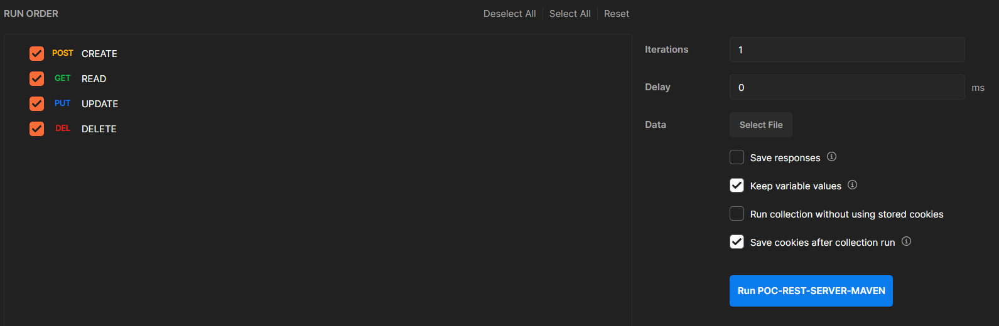
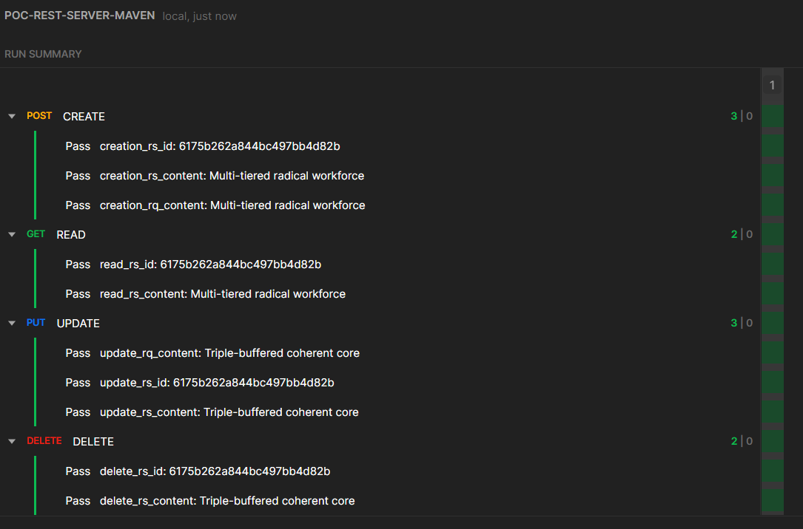

# REST SERVER WITH MAVEN Postman collection
With this small collection you can run an integration test to any server with the following calls:
* CREATE
* READ
* UPDATE
* DELETE

## How-to
* Import the [postman collection file](POC-REST-SERVER-MAVEN.postman_collection.json) into your Postman Application
* You can edit the `url` variable by editing the collection under the `Variables` section
* You can run single requests, or you can run de complete collection which completes a full CRUD flow with validations

## Screenshots
These are some screenshots of the postman collection:

### Create operation request and response

### Create operation pre-request scripts

### Create operation tests

### Running the collection

### Running the collection results
